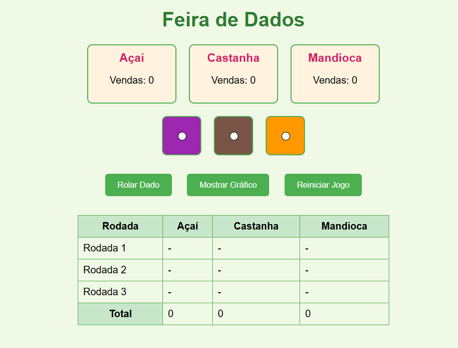

# Simulador do Feira de Dados 🎲

Um jogo pedagógico e interativo desenvolvido para ensinar os conceitos básicos de **Ciência de Dados** de forma simples, visual e **desplugada** de complexidades técnicas. Utilizando a metáfora de uma feira com produtos regionais da Amazônia (**Açaí**, **Castanha** e **Mandioca**), o jogador vivencia o ciclo completo da análise de dados: **coleta**, **organização**, **visualização** e **interpretação**.

---

## 📸 Screenshot



---

## 🎯 O que o jogo faz?
O **Feira de Dados** simula um cenário de vendas em uma feira para que os jogadores possam:

- **Coletar Dados:** rolar dados para gerar números de vendas aleatórios para cada produto.
- **Organizar Dados:** ver os resultados de cada rodada serem automaticamente preenchidos em uma tabela.
- **Visualizar Dados:** transformar os números da tabela em um gráfico de barras comparativo.
- **Interpretar Dados:** analisar o gráfico e a tabela para identificar padrões e descobrir o produto mais vendido.

---

## ✨ Funcionalidades
- **Simulação de Vendas:** role os dados para simular as vendas de Açaí, Castanha e Mandioca.
- **Tabela de Resultados:** acompanhe os resultados de **3 rodadas** em uma tabela clara e organizada.
- **Visualização em Gráfico:** gere um **gráfico de barras** dinâmico para comparar o total de vendas de cada produto.
- **Animação de Dados:** animações simples para tornar a experiência mais interativa.
- **Análise de Resultados:** o jogo anuncia o **produto campeão de vendas** ao final.
- **Design Responsivo Simples:** funciona bem em navegadores de desktop.

---

## 🕹️ Como Jogar
- [ ] Abrir o arquivo `index.html` no navegador.
- [ ] Clicar em **“Rolar Dado”** para iniciar a primeira rodada de vendas.
- [ ] Repetir o processo até completar **3 rodadas**.
- [ ] Clicar em **“Mostrar Gráfico”** para visualizar os resultados e descobrir o produto vencedor.
- [ ] Usar **“Reiniciar Jogo”** para começar uma nova simulação.

---

## 📚 Conceitos Pedagógicos Abordados
- **Coleta de Dados:** entender como os dados são gerados (neste caso, de forma aleatória).
- **Organização de Dados:** estruturar informações em tabelas para facilitar a leitura.
- **Visualização de Dados:** transformar números em **insights visuais** por meio de gráficos.
- **Interpretação de Dados:** tirar **conclusões** a partir dos dados apresentados.

---

## 🛠️ Tecnologias Utilizadas
- **HTML5:** estrutura do conteúdo.
- **CSS3:** estilização e animações.
- **JavaScript (Vanilla):** lógica do jogo e manipulação do DOM.

---

## 🚀 Como Executar o Projeto Localmente

```bash
# Clone este repositório
git clone https://github.com/arlienebatista/feiradedados.git

# Navegue até a pasta do projeto
cd feiradedados
